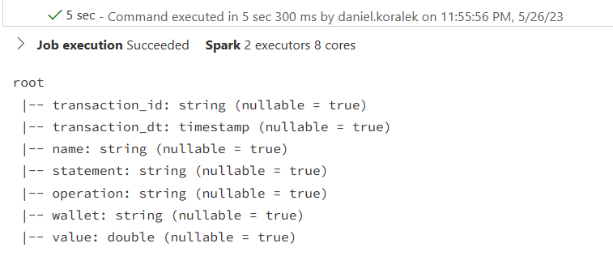
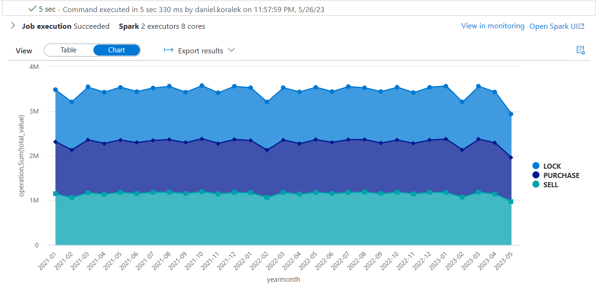
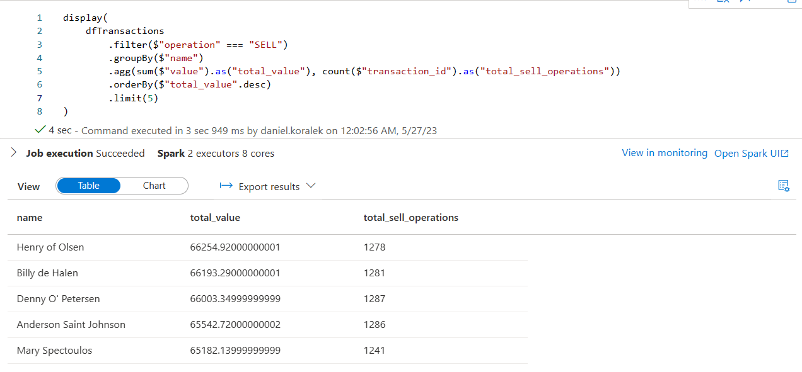

# Spark Scala analyzing the Transactions CSV file

This is a very simple repo containing the basic Scala powered by Spark, used to quickly retrieve the 2MM file stored in the ADLSGen2 Storage Account and perform a schema infer, and also two analytic aggregations.

First, the result of the query option to infer the schema during the spark.read operation:

The result of the first aggregation performed over the entire file, with a small transformation to generate the Y-M column for the aggregation:

The result of the ranking aggregation to display the top sellers after applying a quick filter on the data:

